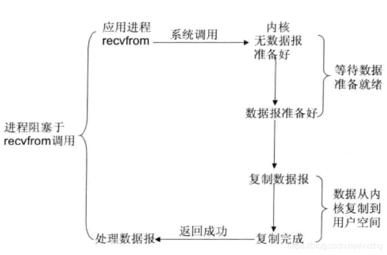
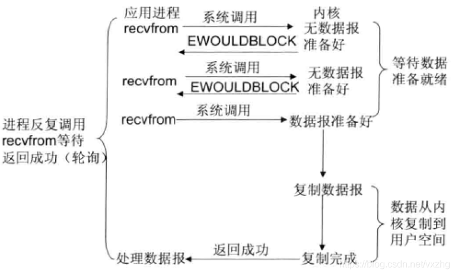
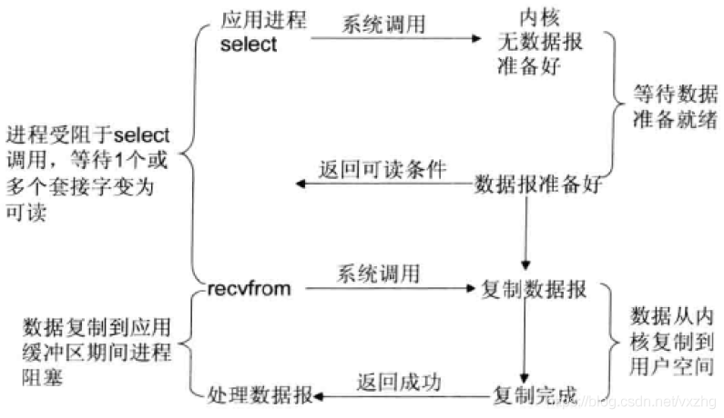
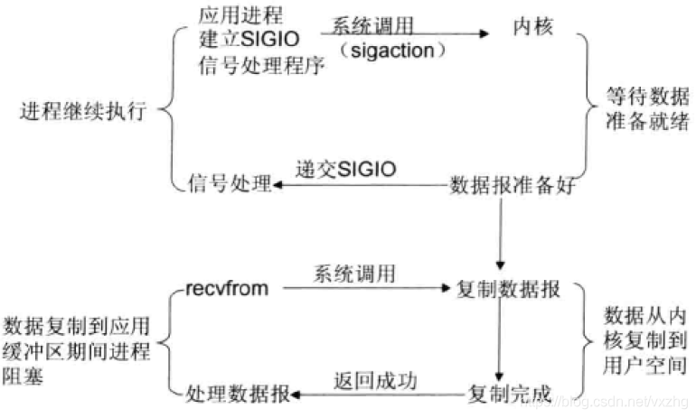
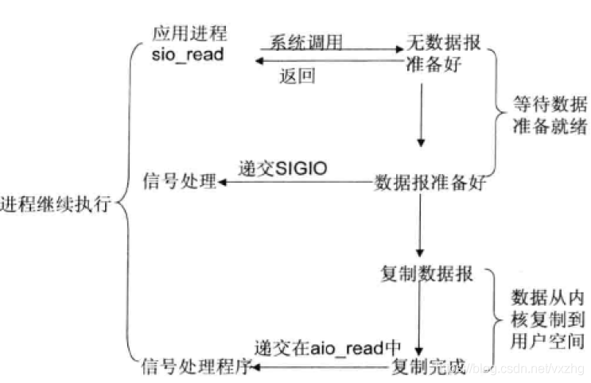

# Netty
Netty 是一款异步的事件驱动的网络应用程序框架，支持快速地开发可维护的高性能的面向协议的服务器
和客户端

- [Netty](#netty)
  - [linux网络I/O模型](#linux网络io模型)
  - [TCP粘包/拆包](#tcp粘包拆包)
  - [Netty编解码](#netty编解码)
  - [Netty多协议封装](#netty多协议封装)
  - [源码分析](#源码分析)

## linux网络I/O模型
  - 阻塞IO  
    在进程空间调用recvform系统调用，等待数据到达内核，等待数据从内核拷贝到用户空间。
    整个等待过程进程都是阻塞的

    

  - 非阻塞IO  
    执行非阻塞I/O系统调用时，如果内核中的数据还没有准备好，会直接返回，不会阻塞。
    通过进程不断查询，直到数据在内核中就绪，便开始拷贝到用户空间。
    拷贝的过程中，进程还是被阻塞了，所以非阻塞IO也是同步IO。
    

  - 多路复用IO
    单个进程处理多个网络连接IO，使用select\poll\epoll三种系统调用，
    不断轮询所有的连接，如果有数据到达内核则通知进程，进行数据拷贝到用户内存  
    - select/epoll区别  
        1:select单进程打开FD有限制，默认1024.epoll无限制  
        2:select随着FD增加而线性下降。epoll是根据每个fd上面callback函数实现，
          只有活跃的socket才会触发。  
        3:epoll通过内核和用户空间mmap同一块存储避免不要的内存复制。  
        4:epoll-API更加简单

    

  - 信号驱动IO
    开启套接口信号驱动I/O功能，调用sigaction执行一个信号处理函数(此调用是非阻塞的)；
    当数据准备就绪时，就为该进程生成一个SIGIO信号，通过信号回调通知应用程序调用recvform来读取数据，并通知主循环函数处理数据。
    

  - 异步IO
    发起read操作后进程立马返回，整个IO过程不会产生任何block。
    kernel会等等数据准备完成，然后将数据拷贝到用户内存。
    当这一切都完成后，kernel会给用户进程发送一个signal，告诉它read操作完成了。
    

##  TCP粘包/拆包  
    TCP是流式协议，它会根据TCP缓冲区实际情况进行包的划分。所以业务上一个包可能会被TCP  
    拆分为多个包发送，也有可能把多个小包封装成一个大的数据包发送。这就是所谓TCP粘包与拆包。
  - 原因分析  
    - 应用程序write写入字节大于套接口发送缓存区大小
    - 进行MSS大小的TCP分段。(MSS=maximum segment size，最大分节大小，为TCP数据包每次传输的最大数据分段大小)
    - 以太网帧的payload大于MTU进行IP分片(maximum transmission unit，最大传输单元，由硬件规定，如以太网的MTU为1500字节)

  - 解决：(应，表，会，传，网，链，物)  
    - 消息长度固定，累计兑取到长度的综合为定长LEN报文后，就认为读取到了一个完整消息：将计数器位置，重新开始
        读取下一个数据报。
    - 将特殊字符(回车符、换行符)作为消息结束符，列如FTP协议，这种方式再问吧协议中应用比较广泛。
    - 通过在消息头定义长度字段来标识消息的总长度。

## Netty编解码  
   - LineBaseFrameDecode(特殊字符\n、\r\n作为结束标识)  
   - DelimiterFrameDecode(特殊字符-分隔符作为流结束标识解码)
   - FixLengthFrameDecode(定长解码)
   - MessagePack 字节编解码  
     - MessageToMessageDecoder（解码） 
     - MessageToByteEncoder （编码）  
     - LengthFieldBaseFrameDecode (在解码前处理字段长度)
       * maxFrameLength  
             最大长度
       * lengthFieldOffset   
            长度记录开始下脚标
       * lengthFieldLength   
            记录长度,读取出来即内容长度
       * lengthAdjustment   
            长度调整值,如内容长度为lengthFieldLength内容值后续即设置为0,
            如lengthFieldLength内容值包含整个长度做调整减去(lengthFieldOffset+lengthFieldLength)
        * initialBytesToStrip  
            忽略长度    
     - LengthFieldPrepender(在编码前增加字段长度)  
   - protobuf (编解码)
   
   
    
## Netty多协议封装   
   - 1.1 HTTP 协议  
   - 1.2 socket 协议
   - 1.3 自定义协议    
     - 1.3.1 netty消息定义表

         | 名称     | 类型     | 长度   | 描述                          |
         | :----- | :----- | :--- | :-------------------------- |
         | header | Header | 变长   | 消息头定义                       |
         | body   | Object | 变长   | 对于请求消息，它是方法的参数，对于响应消息，它是返回值 |

         ​

     - 1.3.2 netty协议消息头定义

       | 名称         | 类型                 | 长度   | 描述                                       |
       | ---------- | ------------------ | ---- | ---------------------------------------- |
       | crcCode    | 整型int              | 32   | Netty消息的校验码，它由三部分组成 1)0xABEF:固定值，表明该消息是Netty协议消息，2字节 2)主版本号：1-255,1个字节 3)次版本号：1-255,1个字节  crcCode = 0xABEF+主版本号+次版本号 |
       | length     | 整型int              | 32   | 消息长度，整个消息，包括消息头和消息体                      |
       | sessionID  | 长整型long            | 64   | 集群节点内全局唯一，由会话ID生成器生成                     |
       | type       | Byte               | 8    | 0：业务消息  1：业务响应消息  2：业务ONE WAY 消息(即是请求又是响应)  3：握手请求消息  4：握手应答消息  5：心跳请求消息  6：心跳应答消息 |
       | priority   | Byte               | 8    | 消息优先级：0~255                              |
       | attachment | Map<String,Object> | 变长   | 可选字段，用于扩展消息头                             |

     - 1.3.3 可靠性设计

          1：心跳机制

          2：重连机制

          3：重复登录保护

          4：消息缓存重发

## 源码分析