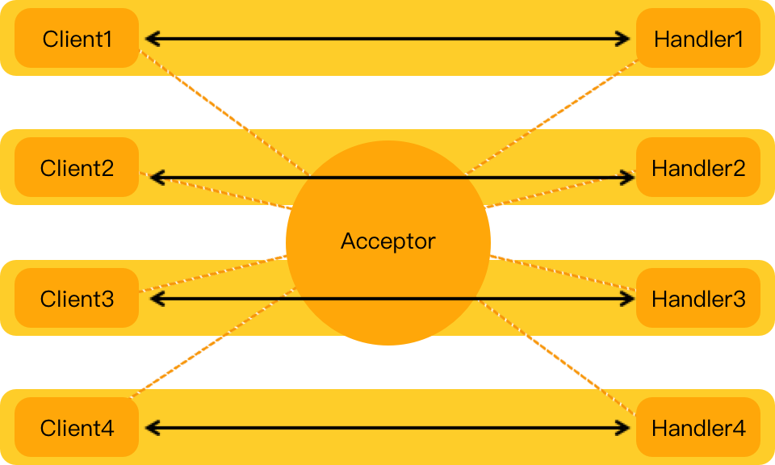
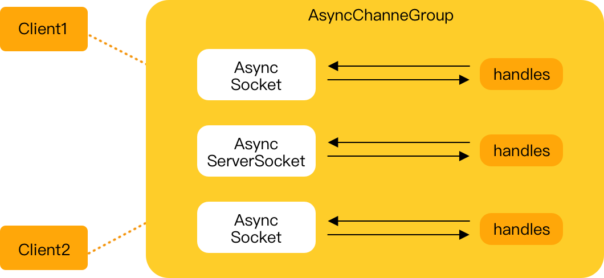

# Netty
Netty 是一款异步的事件驱动的网络应用程序框架，支持快速地开发可维护的高性能的面向协议的服务器
和客户端

##网络编程模型
  - BIO
    同步并阻塞(传统阻塞型)，服务器实现模式为一个连接一个线程，即客户端有连接请求时服务器端就需要启动一个线程进行处理，如果这个连接不做任何事情会造成不必要的线程开销
BIO方式适用于连接数目比较小且固定的架构，这种方式对服务器资源要求比较高，并发局限于应用中。  
    
  - NIO
    同步非阻塞，服务器实现模式为一个线程处理多个请求(连接)，即客户端发送的连接请求都会注册到多路复用器上，多路复用器轮询到连接有I/O请求就进行处理
    NIO方式适用于连接数目多且连接比较短（轻操作）的架构。 
    
  - AIO
    异步非阻塞，AIO 引入异步通道的概念，采用了 Proactor 模式，简化了程序编写，有效的请求才启动线程，它的特点是先由操作系统完成后才通知服务端程序启动线程去处理，一般适用于连接数较多且连接时间较长的应用
    AIO方式使用于连接数目多且连接比较长（重操作）的架构。  
    
    
##Netty  
  1. 传输模型  
     * NIO-非阻塞I/O
     * Epoll-用于Linux的本地非阻塞传输
     * OIO—旧的阻塞I/O
     * Local传输-用于JVM内部通信
     * Embedded传输
  2. ByteBuf 
     * 堆缓冲区
     * 直接缓冲区
     * 符合缓冲区
    

    
    
